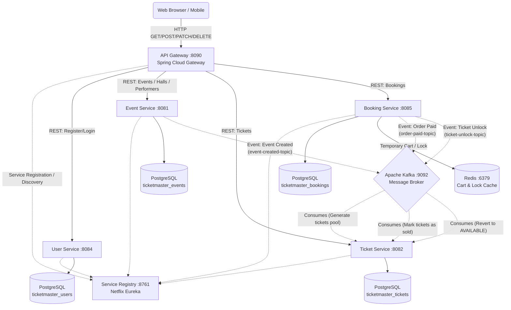

# TicketMaster Project Architecture

TicketMaster is built on an Event-Driven Microservices architecture. Routing, authentication, and inter-service communications are managed using the Spring Cloud ecosystem and Apache Kafka.

## Architecture Diagram

---

## Component Description

### 1. Infrastructure Services
* **Service Registry (Eureka Server):** Consolidates information about running microservice instances, their hosts, and ports. Provides dynamic Service Discovery.
* **API Gateway (Spring Cloud Gateway):** 
  * The single entry point for clients.
  * Acts as a reverse proxy and load balancer.
  * **Authentication:** Intercepts incoming requests, validates the JWT token in the `Authorization: Bearer <token>` header, extracts `userId` and `role`, and propagates them to downstream services via `X-User-Id` and `X-User-Role` HTTP headers.

### 2. Microservices
* **User Service:** Handles user registration, profile management, roles (`ADMIN`, `CUSTOMER`, `ORGANIZATION`), and generates JWT tokens upon login.
* **Event Service:** 
  * Manages events, performers, and concert venues (halls) inside a single `ticketmaster_events` database.
  * Publishes `EventCreatedMessage` to the `event-created-topic` upon successful event creation.
* **Ticket Service:**
  * Manages the lifecycle of tickets (seat, row, sector, status `AVAILABLE`/`SOLD`, price).
  * Listens to the `event-created-topic` and automatically generates a pool of tickets based on venue capacity and categories (VIP, STANDARD, ECONOMY) specified in the event payload.
  * Manages ticket checkout and status updates.
* **Booking Service:**
  * Manages orders, checkout processes, and shopping carts.
  * Uses **Redis** to temporarily lock tickets during checkout to prevent double-booking.
  * Publishes payment confirmation (`order-paid-topic`) and cart expiration/unlock (`ticket-unlock-topic`) events to Kafka.

---

## Security & Authentication

The project uses a decentralized authentication scheme based on JWT:

1. A client authenticates via `POST /api/v1/auth/login`. **User Service** verifies the credentials and returns a signed JWT containing the user ID and role.
2. For all subsequent requests, the client attaches the token in the `Authorization: Bearer ...` header.
3. **API Gateway** validates the token signature using the shared secret key. If valid, the gateway injects downstream headers:
   * `X-User-Id` (User UUID)
   * `X-User-Role` (User Role)
4. Downstream microservices parse these headers using `HeaderAuthenticationFilter` to populate Spring Security's `SecurityContext`, allowing role-based access control annotations like `@PreAuthorize("hasRole('ADMIN')")` without re-verifying the JWT signature.